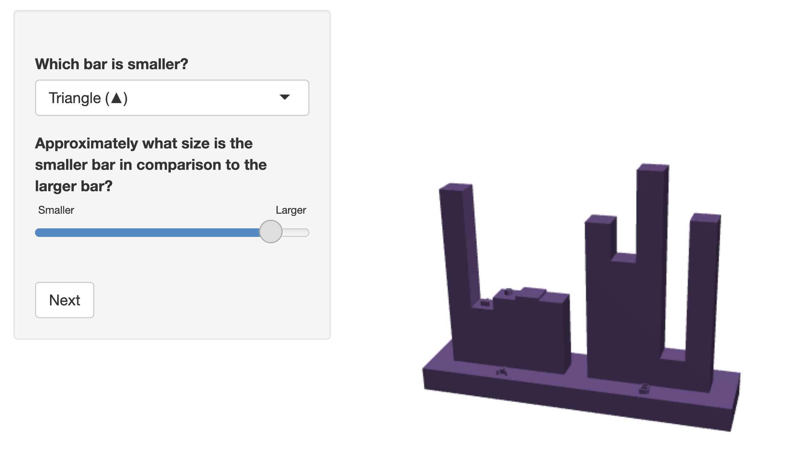
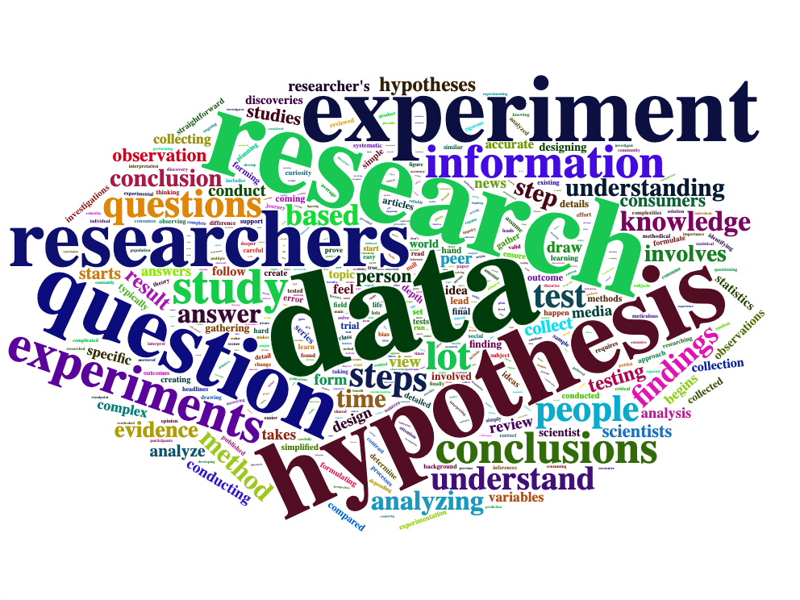

## Introduction

Statistical education emphasizes the use of real data and its application in answering research questions.
Students in introductory statistics courses are mainly exposed to elementary methods and textbook examples that demonstrate the application of these methods, which is used, in part, because of the emphasis on teaching students to think statistically using real data [@carver].
Many textbooks, such as *Introduction to Statistical Investigations* [@tintle2021], use scenarios and ask students to perform the corresponding inferential test.
This process is then repeated over the course material without much deviation in the instructional method.
In some cases, however, students can participate and benefit from well-designed classroom experiments [@mcgowan2011].
This process can expose students to concepts such as randomization and let students see the specifics of experimental design through their participation.
@loy2021a demonstrated that student participants often recalled their experiment in later concepts, showing some evidence that students can benefit from the hands-on experience.

In addition to using experiential learning broadly, a key aspect in the statistics classroom is teaching students to interpret data through visualizations.
Students are often exposed to different types of graphs, such as bar charts, histograms, and boxplots, but often only in the context of how to create and interpret them.
While optimal practices for data visualization have been studied for over a century [@vanderplas2020], there are many areas in data visualization that remain underdeveloped.
This creates a unique opportunity to use these underdeveloped areas as experiential learning opportunities for students to explore and learn about data visualization in a more authentic way.

One area in data visualizations that has not been widely studied is the use of "true" 3D graphs, which are graphs that are created to represent data in our three-dimensional world, as opposed to 3D projections of 2D graphs.
The current mantra is to avoid 3D graphs when possible and studies around the 1990s seem to provide some valid skepticism of their use [@barfield1989; @fisher1997].
@barfield1989 showed that participants were sometimes more accurate using 3D graphs than 2D graphs, depending on the participant's experience level.
However, participants were generally more confident with their answers for 2D graphs.
@fisher1997 observed a similar preference for 2D graphs over 3D graphs when extracting information, but found no preference for visual appeal for the type of graph.
While these results provided valid skepticism toward the use of 3D graphs, the results are generalized to the projections of the 3D graphs.
The area of "true" 3D graphs is largely unexplored, but advances in technology allow for easier access to explore the 3D projections of these graphs.
Some studies have explored the use of 3D graphs in virtual reality [e.g., @kraus2020], but the environment of virtual reality is different than objects produced in the physical world.

Because the use of "true" 3D graphs remains largely unexplored, it provides an opportunity to be used as an experiential learning opportunity for statistics students using active research.
Not only can students benefit from the exposure to different graph types, including "true" 3D graphs, but they can also experience a more personable method of learning, which is more likely to be beneficial to reinforce statistical ways of thinking.

In this paper, we used an experiential learning project that employed different graph types, including "true" 3D graphs, in an introductory statistics classroom environment and described its potential application as an educational tool.
We presented students with a series of modules where they first participated in our experiment on different graph projections, followed by acquiring knowledge on the purpose of the experiment by reading an extended abstract and watching a presentation of a pilot study of the same experiment.

## Methods

### Overview and Motivation

We introduced students enrolled in STAT 218: *Introduction to Statistics* at the University of Nebraska-Lincoln to a graphics project that contained an experiment and progressively revealed components that illustrate the experiment's research objectives.
The project started by providing students with minimal information about the research objectives before revealing the scope of the experiment through an extended abstract and presentation.
The goal of the graphics project was to observe how students think statistically about experiments as both participants and research consumers.
Students were provided with mostly open-ended prompts throughout the graphics project, which allowed us to freely explore common themes in student responses without the limitation of preset choices.

### Experiential Learning

The graphics project was split into two main components regarding the interaction of students with the material.
In this section, we will discuss student interactions with the experiment.
Students were first presented with a series of four modules presented from the role of research participation.
These modules contained the informed consent form, pre-experiment reflection, experiment participation, and post-experiment reflection.
Within the informed consent module, students were informed that their data would be anonymized and that the experiment was exempt from the institutional review board (Project ID: 22579).
While all students were required to participate in the graphics project as part of the course curriculum, we were only able to collect responses when informed consent was obtained and if the student met the age of majority in the state of Nebraska.
In the pre-experiment reflection, students were asked to write a paragraph about how they think the process of scientific investigation looks from the perspective of researchers and the general public.
The experiment participation module asked students to paste the code generated upon completion of the graphics experiment, which is detailed in the next section.
The generated code serves as a basic check to indicate whether or not students fully participated in the experiment.
For the post-experiment reflection, students were asked five questions about the purpose of the experiment.
These include questions on the hypotheses being tested, sources of error, variables of interest, and elements of experimental design.

After completing the experiment reflections, students moved to the reflection of the overall research objectives.
Students were directed to read an unpublished two-page extended abstract that we submitted as a contributed paper for the Symposium on Data Science & Statistics.
The extended abstract outlined the experiment's purpose and procedures, but not the results from our initial pilot study.
After reading the extended abstract, students were asked to write a paragraph about what they found clearer about the experiment's purpose than when they were a participant.
Finally, students watched a 12-minute pre-recorded presentation based on an abbreviated version given at the Symposium on Data Science & Statistics [@wiederich2023].
The video contained the same material as the extended abstract and included the results from our pilot study.
The presentation reflection asked students four questions about the experiment and how information was presented differently than in the extended abstract.

Except for the informed consent and experiment participation modules, all student responses were open-ended.
Each question and its corresponding module can be found in Table 1.

Instructors for STAT 218 were recruited from Summer 2023 to Spring 2025 to administer the graphics project in their classroom.
The instructors were given the option of administering the project as coursework material or extra credit, along with the liberty of grading at their own discretion.
Instructors for the first session of Summer 2023 courses did not have the abstract or presentation modules as they were under development.

<!-- | Module | Question Number | Dataframe Column Index (0-index) | Prompt | -->

<!-- |------------------|------------------:|------------------:|------------------| -->

<!-- | pre-experiment | Q1 | 13 | In this class, you’ll be learning about the process of scientific investigation. What do you think that process looks like, from the perspective of a researcher, compared to what it looks like from the perspective of someone in the general public who is a consumer of scientific results? Write a paragraph (at least 3-5 sentences) about how you think science happens. | -->

<!-- | post-experiment | Q2 | 8 | What do you think the purpose of the experiment was? | -->

<!-- | post-experiment | Q3 | 10 | What hypotheses might the experimenter have been testing? | -->

<!-- | post-experiment | Q4 | 11 | What sources of error are involved in this experiment? | -->

<!-- | post-experiment | Q5 | 12 | What variables were examined? For each variable, identify whether it was quantitative or categorical. | -->

<!-- | post-experiment | Q6 | 9 | What elements of experimental design, such as randomization or the use of a control group, do you think were present in the experiment? Why? | -->

<!-- | abstract reflection | Q7 | 4 | What components of the experiment are clearer now than they were as a participant? What questions do you still have for the experimenter? Write 3-5 sentences reflecting on the abstract. | -->

<!-- | presentation reflection | Q8 | 14 | How did the information you gained from the components of this project (participation, post-study reflection, extended abstract, presentation) differ? | -->

<!-- | presentation reflection | Q9 | 16 | What components were emphasized in the presentation that weren’t emphasized in the abstract? Why do you think that is? | -->

<!-- | presentation reflection | Q10 | 17 | What critiques do you have of this study and its design? What would have made the study better? | -->

<!-- | presentation reflection | Q11 | 15 | If you had to hear about this study using only the extended abstract or only the presentation, which one would you prefer? Which one would be better for determining whether the experiment was well designed? | -->

<!-- : Questions -->

```{r}
library(knitr)
library(kableExtra)
library(dplyr)

df <- tibble::tibble(
  Module = c(
    "pre-experiment",
    rep("post-experiment", 5),
    "abstract reflection",
    rep("presentation reflection", 4)
  ),
  `Question Number` = paste0("Q", 1:11),
  Prompt = c(
    "In this class, you’ll be learning about the process of scientific investigation. What do you think that process looks like, from the perspective of a researcher, compared to what it looks like from the perspective of someone in the general public who is a consumer of scientific results? Write a paragraph (at least 3–5 sentences) about how you think science happens.",
    "What do you think the purpose of the experiment was?",
    "What hypotheses might the experimenter have been testing?",
    "What sources of error are involved in this experiment?",
    "What variables were examined? For each variable, identify whether it was quantitative or categorical.",
    "What elements of experimental design, such as randomization or the use of a control group, do you think were present in the experiment? Why?",
    "What components of the experiment are clearer now than they were as a participant? What questions do you still have for the experimenter? Write 3–5 sentences reflecting on the abstract.",
    "How did the information you gained from the components of this project (participation, post-study reflection, extended abstract, presentation) differ?",
    "What components were emphasized in the presentation that weren’t emphasized in the abstract? Why do you think that is?",
    "What critiques do you have of this study and its design? What would have made the study better?",
    "If you had to hear about this study using only the extended abstract or only the presentation, which one would you prefer? Which one would be better for determining whether the experiment was well designed?"
  )
)

kable(
  df,
  caption = "Question prompts for each module",
  booktabs = TRUE,
  longtable = TRUE,
  align = c('c', 'c', 'l')
) %>% 
  kable_styling(
    latex_options = c("repeat_header", 'striped'),
    full_width = FALSE
  ) %>% 
  column_spec(1, width = "3cm") %>% 
  column_spec(2, width = "2cm") %>% 
  column_spec(3, width = "10cm")

```

### Data Analysis

Since nearly all of the student responses to the project modules are open-ended, the analysis of the project modules is largely qualitative.
We will selectively extract student responses that demonstrate variability and repetitive themes in their understanding of the graphics experiment.
Additionally, word clouds and bigram plots will be constructed for select questions.
For all modules, except the Post-Experiment reflection, students are asked to comment on the experiment without an objectively correct response.

For paragraph responses in the Pre-Experiment and Abstract reflections, bigram plots are used as a graphical analysis to display word pairs after removing stop words (e.g., "the" and "and").
These word pairs help illustrate common themes that students wrote about in their longer prompts.
In the Post-Experiment reflection, the prompts have objectively correct answers but would require a subjective aggregation to indicate the level of correctness.
Instead, we opt to select at least one student response that we consider to be "most correct" and a couple of other responses that are either partially correct or entirely incorrect to illustrate the variability of the responses.
The results of the graphics experiment are presented by @wiederich as an extension of a larger study comparing the dimensionality and projections of 2D and 3D bar charts.

#### Topic Modeling

In addition to qualitative analyses, we incorporate topic modeling to uncover common themes in student responses.
BERTopic is a modern topic modeling approach that combines transformer-based embeddings with clustering to identify topics from text data.
We selected BERTopic over alternatives like Latent Dirichlet allocation (LDA) and Top2Vec because our responses contain both short and long-form answers with an unknown number of topics [@kumari2026].
The method is highly modular, allowing independent parameter tuning at each stage.
While the formulation of BERTopic is outside the scope of this paper, we describe the overview of the process and our parameter choices in the following sections.

##### Embedding

The first step of BERTopic converts text into numerical representations in a high-dimensional space using sentence transformers, which capture the semantic meaning of documents.
Many open-weight models exist for this purpose, although the training and pipeline is sometimes not open.
BERTopic's default transformer is `all-MiniLM-L6-v2`, but we used `all-mpnet-base-v2`, which has been shown to perform better on semantic similarity tasks at the cost of computational speed and memory [@colangelo2025].
Our sample size is small enough that the computational times between the two transformers is not largely different, so we opt for the better sentence

##### Dimensional Reduction

High-dimensional embeddings often benefit from dimensionality reduction prior to clustering to mitigate the curse of dimensionality while preserving meaningful semantic structure.
BERTopic uses UMAP by default [@mcinnes], which constructs a weighted k-nearest neighbor graph to approximate the local topological structure of the embedding space and optimizes a low-dimensional representation that preserves this structure.

Two UMAP hyperparameters are tuned based on the number of responses: `n_neighbors` (default: 15) and `n_components` (default: 5).
The `n_neighbors` parameter controls the balance between local and global structure in the underlying graph.
Smaller values emphasize local relationships and can yield more fine-grained but potentially noisier topic separation, while larger values produce smoother structure that may merge related topics.
This parameter is tuned to balance topic granularity without excessive fragmentation or over-aggregation.
The `n_components` parameter defines the dimensionality of the reduced embedding space.
For our dataset, these parameters are adjusted per prompt.

##### Clustering

BERTopic's default clustering method, HDBSCAN, identifies clusters by modeling regions with different densities [@mcinnes2017].
This approach has two key advantages: clusters are not constrained to specific shapes, and it can identify outliers without forcing them into clusters where they don't belong.
The flexibility of HDBSCAN makes it more suitable for clustering semantic embeddings than other methods, such as k-means clustering and model-based clustering, where stronger distributional assumptions are required.

The primary tuning parameter is `min_cluster_size`, which specifies the minimum number of observations required to form a cluster.
Smaller values allow for more fine-grained topic detection, which is useful when only a few respondents mention a shared concept, but may increase sensitivity to noise.
We therefore set this parameter relatively low to capture smaller clusters and increased it until we achieved a balance granularity and cluster stability

##### Vectorizers

Once clusters are identified, all documents are combined and have frequently occurring terms identified.
We use n-grams to capture phrases up to two words long to obtain statistics terminology like "sample size" and "hypothesis testing".
We also remove common stop words ("the", "and", etc.) that add no thematic value using the English stop words provided by `sklearn` [@scikit].

There may be phrases in each assigned document that appear infrequently or too often that they dominate the text representation of the topic.
To address this, `max_df` and `min_df` are two parameters that filter out phrases.
`max_df` removes phrases that occur in the majority of documents, which can be considered as corpus-specific stop words.
For example, Q1 prompts students with phrases like "scientific investigation" and "scientific results", which are likely phrases to appear in the majority of responses despite not being typical English stop words.
`min_df` functions similarly as `max_df`, except that phrases are removed if they do not occur often enough in the topic documents.
Both parameters are set as either integers for the number of documents or as floats (0-1) for the proportion of documents.
It is important to note that term removal is performed after clustering, and thus not changing the topic identity.
These parameters are selected to increase the representation of topic terms for each category.

##### c-TF-IDF

c-TF-IDF attempts to address phrase overlap by reweighting words so that common terms matter less and topic-specific terms become more prominent.
By treating each topic as a single aggregated document, it captures the overall importance of terms within that topic rather than at the individual document level.
This results in clearer topic representations and improves the separation between similar topics.
The weighting is calculated as follows:

$$
W_{X,C}=||\text{tf}_{X,C}||\times\log(1+\frac{A}{f_X})
$$

where $\text{tf}_{X,C}$ is the frequency of word $X$ in topic $C$, $f_X$ is the frequency of word $X$ across all topics, and $A$ is the average number of words per topic.

`bm25_weighting` and `reduce_frequent_words` are two boolean arguments that can help increase robustness and reduce frequent words across multiple topics.
Combined, the these arguments adjust the weighting as follows:

$$
W_{X,C}=\sqrt{||\text{tf}_{X,C}||}\times\log(1+\frac{A-f_X+0.5}{f_X+0.5})
$$ With a relatively small number of responses per question and prompted questions, we enable both `bm25_weighting` and `reduce_frequent_words`.

##### Refinement

Up until this point, a list of representative keywords has been generated for each topic identified from the input documents.
This optional stage allows for an extra layer of refinement using various strategies, and can be performed simultaneously.
Due to this flexibility, we use several of these methods to compare representative words from generated topics.
Our chosen models can be found in @tbl-representation-models.

| Method | Summary | Notes |
|-------------------|--------------------------------|---------------------|
| KeyBERT Inspired | Uses principles of KeyBERT [@sharma] for keyword extraction |  |
| Part Of Speech | Extracts words using part of speech | Valid patterns: adj noun, noun, adj |
| Maximal Marginal Relevance | Maximizes the difference between topic words |  |

: Representation Models for BERTopic {#tbl-representation-models}

### Graphics Experiment

In this section, we describe the experimental design used by students in the study.
Students were presented with the design of the experiment in the extended abstract and with the results of the pilot study in the video presentation.
The presentation used results from our initial pilot study [@wiederich2024], which was identical in experimental procedure except for the inclusion of an additional chart type.

#### Constructing Stimuli

Based on Cleveland and McGill's seminal work on graphical perception [-@cleveland1984], participants were presented with a series of bar graphs where two bars are marked with either a circle or a triangle.
The heights of the bars were chosen from the following equation:

$$s_i=10\cdot 10^{(i-1)/12}, \qquad i=1,2,3,...,10$$ {#eq-vals}

where $s_i$ represents a value given an integer $i$ as defined above.
The values $s_i$ from @eq-vals were then paired such that the ratio of the smaller value to the larger value yield the ratios of 0.178, 0.261, 0.383, 0.464, 0.562, 0.681, and 0.825.
Each bar graph has two groupings of five bars.
Following the Type 1 and Type 3 graphs from the position-length experiment by @cleveland1984, the value pairs for each ratio were either placed in the first grouping on the second and third bars (adjacent) or placed on the second bars in each grouping (separated).

To explore the effect of dimensionality and projection of the bar graphs, we introduced the following plot types: 2D digital, 3D digital (static), 3D digital (interactive), and 3D printed.
There was no single software package that could create all four plot types, so we carefully constructed graphs from different software packages to be as similar as possible.
The 2D digital plots were rendered with the `ggplot2` package [@ggplot2].
Microsoft Excel® was used to render the 3D digital (static) plots.
The 3D digital (interactive) and 3D printed plots were created with OpenSCAD® [@kintelOpenSCADDocumentation2023], where the generated stereolithography (STL) files for the 3D digital (interactive) plots were rendered with the `rgl` package [@rgl].
The 3D digital (static) plots were included after the initial pilot study, and thus not represented in the extended abstract or video presentation.

#### Experimental Design

With 56 treatment combinations, we opted to use an incomplete block design to provide participants with 15-20 graphs.
Kits of graphs were constructed so that five of the seven ratios are equally represented, resulting in 21 different kits.
Within each kit, all graph types appeared for each ratio and the comparison type was randomly assigned.
A visual layout of the experiment is shown in Figure 1.
All kits received a unique identifier and a set of instructions for accessing the experiment.

{#fig-exp-design fig-align="center" out-width="100%"}

A Shiny application [@shiny] was designed to administer the experiment.
Students were directed to randomly select a kit of graphs and visit the Shiny application's website linked on the instructions.
For students enrolled in the online sections of STAT 218, the website was provided by the instructor and they were prompted in the application to select that they were an online participant; selecting online participation resulted in the 3D-printed plots being removed from the set of graphs presented to the participant.
After students provided a kit identifier (if applicable), students were presented with graphs in a randomized order.
If the student marked that they were an online participant, the 3D-printed graphs were removed from their experiment lineup and they were randomly assigned a kit of graphs.
Each graph asked the students to first identify the larger marked bar and then to guess the height of the smaller marked bar if the larger marked bar was 100 units tall using a slider widget.
After completing the experiment, a completion code was generated for students to paste into the experiment participation module.

{#fig-shiny-app fig-align="center" out-width="90%"}

## Results

```{r}
#| label: data
#| warning: false
#| echo: false
#| include: false
#| message: false

# Options
knitr::opts_chunk$set(echo = F, warning = F, message = F)

# Read data
library(tidyverse)
res <- read_csv('../../data/student-responses.csv') %>% 
  filter(experiment == 'Bar chart')
q_pos <- c(13, 8, 10, 11, 12, 9, 4, 14, 16, 17, 15) + 1 #Zero index, so add 1
q_lab <- factor(paste0('Q', 1:length(q_pos)), 
                levels = paste0('Q', 1:length(q_pos)),
                ordered = T)
q_df <- data.frame(
  question = names(res[q_pos]),
  label = q_lab,
  module = c('Pre-experiment', 
             rep('Post-experiment', 5), 
             rep('Abstract', 1), 
             rep('Presentation', 4))
)
```

We recruited `r length(unique(res$section))` sections of STAT 218 to participate in the experiential learning project.
Each instructor offered the project as participation credit or extra credit in their course and student participation for data collection was entirely voluntary.
A total of `r nrow(res)` students participated in the project.
@fig-student-responses-count displays the counts of responses per question.

```{r}
#| label: fig-student-responses-count
#| fig-cap: "Counts of question completions. The dashed line represents the total number of students who completed at least one question."
#| fig-scap: "Reflection completions"
res_long <- res %>% 
  pivot_longer(q_pos, names_to = 'question', values_to = 'response') %>% 
  select(id, section, question, response) %>% 
  left_join(q_df)

res_long %>% 
  group_by(question, label, module) %>% 
  summarize(count = sum(!is.na(response))) %>% 
  ggplot(mapping = aes(x = label, y = count, fill = module)) + 
  geom_col() + 
  # geom_col(mapping = aes(y = nrow(res)), fill = NA, color = 'black') + 
  geom_hline(yintercept = nrow(res), linetype = 'dashed') +
  theme_bw() + 
  labs(x = 'Question', y = 'Count of responses', fill = 'Module') + 
  theme(panel.grid.major.x = element_blank())

```

As expected, the number of completions decreased as the project progressed.
The pre-experiment module was provided at the start of each semester during the withdrawal window for courses at the University of Nebraska, so some students would likely drop out of the course before completing later modules.
The lower completion rates for the presentation module is largely attributed to the first few sections of STAT 218 that participated in the project since the video presentation was under development for the first few sections that participated in the project.

### Responses from Experiment Participation

```{r}
library(wordcloud2)
library(tidytext)
library(igraph)
library(ggraph)
library(webshot2)

# Read in all BERTopic files
q_path <- '../../data/bertopic_exports/per_question/'
q <- list()
for(i in 1:11) {
  q_files <- list.files(pattern = '.csv', path = glue::glue('{q_path}q{i}') , recursive = T)
  q[[i]] <- map(glue::glue('{q_path}q{i}/{q_files}'), read.csv)
}
```

#### Pre-Experiment Reflection

In the first stage of the project, before participating in the experiment, students had limited information about the research objectives, and we recorded how they thought about scientific research.
Students were initially prompted to write 3-5 sentences in response to the question, "What do you think \[the\] process \[of scientific investigation\] looks like, from the perspective of a researcher, compared to what it looks like from the perspective of someone in the general public who is a consumer of scientific results?" These responses gave us a broad picture of what students initially believed the research process looked like.

```{r}
#| label: fig-q1-wordcloud
#| fig-cap: "Wordcloud of pre-experiment reflection. Stop words and prompt words were removed."
#| fig-scap: "Pre-experiment reflection wordcloud"
#| fig-width: 5

library(webshot)
library(htmlwidgets)

# res_long %>% 
#   filter(label == 'Q1') %>% 
#   unnest_tokens(word, response) %>% 
#   group_by(word) %>% 
#   count(sort = T) %>% 
#   filter(!(word %in% stop_words$word),
#          !(word %in% c('process', 'public', 'researcher', 'results', 'investigation', 'scientific', 'perspective', 'general', 'consumer', 'science'))) %>% 
#   wordcloud2() %>% 
#   saveWidget(file = 'q1-wordcloud.html')

# webshot('q1-wordcloud.html', 'q1-wordcloud.png')


```

Students generally understood the purpose of scientific research by connecting it to hypothesis testing and publication.
Many responses described research as starting with a question, followed by data collection, experimentation, and then communication of results to the public.
The most common phrase groupings included variations of "scientific research," "data collection," and "peer review." The top 20 bigrams are shown in @fig-q1-bigram.

```{r}
#| label: fig-q1-bigram
#| fig-cap: "Top 20 bigrams from pre-experiment reflection"
#| fig-scap: "Top 20 pre-experiment reflection bigrams"
#| fig-width: 5.5
#| fig-height: 3
#| fig-dpi: 600
res_long %>% 
  filter(label == 'Q1') %>% 
  unnest_tokens(word, response, token = 'ngrams', n = 2) %>% 
  group_by(word) %>% 
  count(sort = T) %>% 
  separate(word, into = c('word1', 'word2'), sep = ' ') %>% 
  filter(!(word1 %in% stop_words$word) & !(word2 %in% stop_words$word) & !is.na(word1) & !is.na(word2)) %>% 
  mutate(word = paste(word1, word2), .keep = 'unused') %>% 
  filter(!is.na(word)) %>% 
  arrange(-n) %>% 
  head(20) %>% 
  ggplot(mapping = aes(y = reorder(word, n), x = n)) + 
  geom_col() + 
  theme_bw() + 
  labs(x = 'Count', y = 'Bigram')
```

Topic modeling produced `r nrow(q[[1]][[2]])-1` topics from the pre-experiment reflection.
Many of these topics were closely related to the process of scientific investigation, which is expected given the wording of the Q1 prompt.
Topics 2 and 3 focused on the communication of scientific work, including news and social media, while topics 5, 9, and 10 appeared to reflect students thinking about hypotheses and research questions.
The remaining topics had fewer distinct keywords and seemed to track more closely with the phrasing of the prompt itself.

```{r}
#| fig-width: 5.5
#| fig-height: 6
#| fig-dpi: 600
#| fig-cap: "Top 5 words from pre-experiment reflection topics using c-TF-IDF score."
#| fig-scap: "Top pre-experiment reflection topic words"

# 1: document with top probability
# 2: document with all probability, long
# 3: document with all probability, wide
# 4: topics with counts
# 5: topic words with score and rank

q[[1]][[5]] %>%
  filter(topic > -1) %>%
  filter(rank <= 5) %>%
  ggplot(mapping = aes(y = reorder(word, score), x = score)) + 
  geom_col() + 
  # facet_wrap(~topic, scales = 'free_y', nrow = 5) + 
  theme(aspect.ratio = 1/2) +
  theme_bw() +
  labs(x = 'c-TF-IDF', y = '') +
  facet_wrap(~topic, scales = 'free_y', ncol = 2, labeller = label_both)
```

#### Post-Experiment Reflection

After participating in the experiment, students responded to prompts about the research objectives, which were to evaluate errors in ratio judgments between 2D and 3D graph types under different comparison conditions in a randomized block design.
Many students identified parts of the experiment correctly, but most missed at least one key component of what would count as a complete answer.

For example, when asked, "What do you think the purpose of the experiment was?", a complete response would have referred to the comparison of ratio judgments across 2D and 3D graphs.
One student gave a strong response by saying, "I think this experiment aimed to test if it was easier to compare two graphs in 2D or 3D." Another student was mostly correct, writing, "I think the purpose of this experiment was for the researcher to gather data on how people perceive, interpret, and understand 3D graphs." However, some responses reflected misunderstandings of the research question, such as student swho suggested the study was about demographic differences in perception.

There were `r nrow(q[[2]][[4]])-1` distinct topics identified from the BERTopic model for Q2 responses.
These topics generally reflected how accurately people estimated values from different chart types, as well as comparisons among chart types and the process of estimating chart values.

```{r}
#| label: q2-bertopic
#| fig-cap: "Top 5 words from Q2 reflection topics using c-TF-IDF score."
#| fig-scap: "Top Q2 reflection topic words"
#| fig-width: 5.5
#| fig-height: 5.5
#| fig-dpi: 300

library(ggtext)

q[[2]][[5]] %>%
  filter(topic > -1) %>%
  filter(rank <= 5) %>%
  ggplot(mapping = aes(y = reorder(word, score), x = score)) + 
  geom_col() + 
  theme_bw() +
  theme(aspect.ratio = 1/2) +
  labs(x = 'c-TF-IDF', y = '', title = 'What do you think the purpose of the experiment was?') +
  facet_wrap(~topic, scales = 'free_y', ncol = 2, labeller = label_both) + 
  theme(plot.title = element_textbox_simple(hjust = 0.5, margin = margin(b = 10)))
```

We then asked students, "What hypotheses might the experimenters have been testing?" A correct response would have focused on differences in errors of ratio judgments between graph types.
One student offered a strong response by stating, "They might have been testing if a 2D model is easier to estimate its relative size to another when compared to a 3D model of it." Other students offered responses that were not directly measurable from the experiment, such as claims about how taking STAT 218 affects comparison ability or that 2D is preferred over 3D because it makes the data presentation clearer.

```{r}
num_students_q23 <- res_long %>% 
  filter(label %in% c('Q2', 'Q3'), !is.na(response)) %>% 
  group_by(id) %>% 
  count()
  
q23 <- res_long %>% 
  filter(label %in% c('Q2', 'Q3')) %>% 
  group_by(id) %>% 
  unnest_tokens(word, response) %>% 
  filter(str_detect(word, '(2d|3d|digital|physical|dimension)')) %>% 
  group_by(id) %>% 
  count()
```

In general, many students responded to Q2 and Q3 with answers that included the dimensionality of the charts.
Of the `r nrow(num_students_q23)` responses to these questions, `r nrow(q23)` included some mention of the words 2D, 3D, digital, physical, or dimension.
This value is lower than what we would expect, but many other responses tended to include mentions of accuracy or estimating values when reading charts.

```{r}
#| label: q3-bertopic
#| fig-cap: "Top 5 words from Q3 reflection topics using c-TF-IDF score."
#| fig-scap: "Top Q3 reflection topic words"
#| fig-width: 5.5
#| fig-height: 5.5
#| fig-dpi: 300

q[[3]][[5]] %>%
  filter(topic > -1) %>%
  filter(rank <= 5) %>%
  ggplot(mapping = aes(y = reorder(word, score), x = score)) + 
  geom_col() + 
  theme_bw() +
  theme(aspect.ratio = 1/2) +
  labs(x = 'c-TF-IDF', y = '', title = 'What hypotheses might the experimenters have been testing?') +
  facet_wrap(~topic, scales = 'free_y', ncol = 2, labeller = label_both) + 
  theme(plot.title = element_textbox_simple(hjust = 0.5, margin = margin(b=10)))
```

For Q4, students were asked about sources of error in the experiment, and for Q5, they were asked to identify the variables examined and classify them as quantitative or categorical.
In both cases, responses varied widely.
Some students recognized sources of error and variable structure accurately, while others focused more on general impressions of the graphs than on the specific design features of the experiment.

```{r}
#| label: q4-bertopic
#| fig-cap: "Top 5 words from Q4 reflection topics using c-TF-IDF score."
#| fig-scap: "Top Q4 reflection topic words"
#| fig-width: 5.5
#| fig-height: 5.5
#| fig-dpi: 300

q[[4]][[5]] %>%
  filter(topic > -1) %>%
  filter(rank <= 5) %>%
  ggplot(mapping = aes(y = reorder(word, score), x = score)) + 
  geom_col() + 
  theme_bw() +
  theme(aspect.ratio = 1/2) +
  labs(x = 'c-TF-IDF', y = '', title = 'What sources of error are involved in this experiment?') +
  facet_wrap(~topic, scales = 'free_y', ncol = 2, labeller = label_both) + 
  theme(plot.title = element_textbox_simple(hjust = 0.5, margin = margin(b=10)))
```

```{r}
#| label: q5-bertopic
#| fig-cap: "Top 5 words from Q5 reflection topics using c-TF-IDF score."
#| fig-scap: "Top Q5 reflection topic words"
#| fig-width: 5.5
#| fig-height: 5.5
#| fig-dpi: 300

q[[5]][[5]] %>%
  filter(topic > -1) %>%
  filter(rank <= 5) %>%
  ggplot(mapping = aes(y = reorder(word, score), x = score)) + 
  geom_col() + 
  theme_bw() +
  theme(aspect.ratio = 1/2) +
  labs(x = 'c-TF-IDF', y = '', title = 'What variables were examined?') +
  facet_wrap(~topic, scales = 'free_y', ncol = 2, labeller = label_both) + 
  theme(plot.title = element_textbox_simple(hjust = 0.5, margin = margin(b=10)))
```

An important topic covered in STAT 218 is randomization, which we asked students with the prompt "What elements of experimental design, such as randomization or the use of a control group, do you think were present in the experiment? Why?" In the experiment, randomization was performed with the ordering and assignment of graphs into kits.
One student perfectly described randomization by responding with the following:

> "Randomization: The survey used an experimental design where in the survey there were different sets of 3D charts and maybe by a randomization process each participant was shown a different set of charts to see the differences in interpretations of the charts based on which set was assigned. Control Group: Since this survey aimed to only understand how participants interpret 3D charts without comparison to other chart types, then no control group was needed."

A common theme was that the randomization process was through the sampling of participants being STAT 218 students.
One student responded that randomization was through "random students in the stats class." Some students did not think that randomization was not present, with one student saying "\[r\]andomization was not used because it was offered as an extra credit assignment in class." In actuality, we used a convenience sample since we did not randomly select students to participate, which is standard practice for many studies conducted with students in collegiate settings.

```{r}
#| label: q6-bertopic
#| fig-cap: "Top 5 words from Q6 reflection topics using c-TF-IDF score."
#| fig-scap: "Top Q6 reflection topic words"
#| fig-dpi: 600
#| fig-width: 5.5
#| fig-height: 5.5

q[[6]][[5]] %>%
  filter(topic > -1) %>%
  filter(rank <= 5) %>%
  ggplot(mapping = aes(y = reorder(word, score), x = score)) + 
  geom_col() + 
  # facet_wrap(~topic, scales = 'free_y', nrow = 5) + 
  theme(aspect.ratio = 1/2) +
  theme_bw() +
  labs(x = 'c-TF-IDF', y = '', title = 'What elements of experimental design, such as randomization or the use of a control group, do you think were present in the experiment?') +
  facet_wrap(~topic, scales = 'free_y', ncol = 2, labeller = label_both) + 
  theme(plot.title = element_textbox_simple(hjust = 0.5, margin = margin(b=10)))
```

### Responses from Research Reflections

In this set of reflections, students first read the extended abstract, followed by watching the 12-minute presentation video.
The abstract unveiled the scope of the study to students, many of whom did not realize the underlying complexities.
Nearly all students responded with statements about gaining clarity about the purpose of the experiment and its role in testing the differences between 2D and 3D graphs.
Students commented on how they now understood the purpose of comparing 2D and 3D graphs, and also the potential benefits that may stem from research, such as graphical accessibility to the visually impaired.
A bigram plot of the student responses to the abstract reflection prompt is shown in @fig-q7-bigram

```{r}
#| label: fig-q7-bigram
#| fig-cap: "Top 20 bigrams from abstract reflection"
#| fig-scap: "Top 20 abstract reflection bigrams"
#| fig-width: 5.5
#| fig-height: 3
#| fig-dpi: 600
res_long %>% 
  filter(label == 'Q7') %>% 
  unnest_tokens(word, response, token = 'ngrams', n = 2) %>% 
  group_by(word) %>% 
  count(sort = T) %>% 
  separate(word, into = c('word1', 'word2'), sep = ' ') %>% 
  filter(!(word1 %in% stop_words$word) & !(word2 %in% stop_words$word) & !is.na(word1) & !is.na(word2)) %>% 
  mutate(word = paste(word1, word2), .keep = 'unused') %>% 
  filter(!is.na(word)) %>% 
  arrange(-n) %>% 
  head(20) %>% 
  ggplot(mapping = aes(y = reorder(word, n), x = n)) + 
  geom_col() + 
  theme_bw() + 
  labs(x = 'Count', y = 'Bigram')
```

```{r}
#| label: q7-bertopic
#| fig-cap: "Top 5 words from abstract reflection topics using c-TF-IDF score."
#| fig-scap: "BERTopic - Q7"
#| fig-width: 5.5
#| fig-height: 5.5
#| fig-dpi: 300

q[[7]][[5]] %>%
  filter(topic > -1) %>%
  filter(rank <= 5) %>%
  ggplot(mapping = aes(y = reorder(word, score), x = score)) + 
  geom_col() + 
  # facet_wrap(~topic, scales = 'free_y', nrow = 5) + 
  theme_bw() +
  theme(aspect.ratio = 1/2) +
  labs(x = 'c-TF-IDF', y = '', title = 'What components of the experiment are clearer now than they were as a participant? What questions do you still have for the experimenter?') +
  facet_wrap(~topic, scales = 'free_y', ncol = 2, labeller = label_both) + 
  theme(plot.title = element_textbox_simple(hjust = 0.5, margin = margin(b=10)))
```

When discussing critiques of the study and its design, students frequently commented on a lack of initial information and concerns about generalizability to broader populations.
Many reported that they did not fully understand the purpose of the study, which limited their ability to engage with or evaluate the design effectively.
Students also emphasized that the sample from an introductory-level statistics restricted generalizability.
This stage of the project was given after students completed the section on causation, so it is reassuring to see students connecting their course material to their reflection.
While acknowledging the convenience nature of the sampling approach, some students also questioned the quality of the resulting data.
One student noted:

> "I feel that using an entry-level statistics course was not the best sample group because of the lack of care for the experiment by the students. Many of my classmates with whom I discussed this experiment emphasized how they just clicked through the answers. This will distort the findings not to be as accurate as they could be."

```{r}
#| label: q10-bertopic
#| fig-cap: "Top 5 words from abstract reflection topics using c-TF-IDF score."
#| fig-scap: "BERTopic - Q8"
#| fig-width: 5.5
#| fig-height: 5.5
#| fig-dpi: 300

q[[10]][[5]] %>%
  filter(topic > -1) %>%
  filter(rank <= 5) %>%
  ggplot(mapping = aes(y = reorder(word, score), x = score)) + 
  geom_col() + 
  theme_bw() +
  theme(aspect.ratio = 1/2) +
  labs(x = 'c-TF-IDF', y = '', title = 'What critiques do you have of this study and its design? What would have made the study better?') +
  facet_wrap(~topic, scales = 'free_y', ncol = 2, labeller = label_both) + 
  theme(plot.title = element_textbox_simple(hjust = 0.5, margin = margin(b=10)))
```

```{r}
#| eval: false
q11 <- res_long %>% 
  filter(label == 'Q11', !is.na(response)) %>% 
  mutate(
         # Did not specify, or only mentioned abstract or presentation 
         neither             = !str_detect(response, regex('(video|presentation|abstract)', ignore_case = T)),
         only_abstract       =  str_detect(response, regex('abstract', ignore_case = T)) & !str_detect(response, regex('(presentation|video|slide)', ignore_case = T)),
         only_presentation   =  !str_detect(response, regex('abstract', ignore_case = T)) & str_detect(response, regex('(presentation|video|slide)', ignore_case = T)),
         
         # Preference and talked about othe
         prefer_presentation =  str_detect(response, regex('(think|prefer|like|choose|hear|watch|read)(?:(?!abstract).)*?(presentation|video|slide)', ignore_case = T)),
         prefer_abstract     =  str_detect(response, regex('(think|prefer|like|choose|hear|watch|read)(?:(?!presentation|video|slide).)*?(abstract)', ignore_case = T)),
         
         #Putting things together
         preference = case_when(
           neither ~ 'No preference',
           only_abstract | (!prefer_presentation & prefer_abstract) ~ 'Abstract',
           only_presentation | (prefer_presentation & !prefer_abstract) ~ 'Presentation',
           prefer_presentation & prefer_abstract ~ 'Both'
         )
         )
```

Lastly, many students responded that they preferred the presentation over the extended abstract when asked "If you had to hear about this study using only the extended abstract or only the presentation, which one would you prefer? Which one would be better for determining whether the experiment was well designed?" One student responded "I am a visual learner so I would have rather heard about in through the presentation. It also broke down the steps which is easier for me to understand. I think the presentation as a whole would be better for determining how the experiment is designed." On the other hand, there was another student said "Personally I like the abstract better. If I get confused on something it is so much easier to go back and reread to understand what is going on. If I ask myself questions about it, it is much easier to go back and find answers to the questions as well." A common theme for students who prefered the presentation was that it included the results, which were not a part of the extended abstract.

## Discussion

Taken together, our results support the idea that we achieved our goal of providing students of an introductory statistics course with the opportunity to reflect on active research.
Students generally appreciated the progressively revealing nature of the graphics project, which is evident from the abstract and presentation reflections.
When provided with the post-experiment reflections, students often either missed the research objectives of the experiment or had partially correct responses.
However, this was expected since the design of the experiment exceeds the scope of experimental design taught in typical introductory statistics courses.

The abstract reflection received many responses indicating that students had moments of realization about the true nature of our research goals, which was further expanded with the presentation reflection prompts.
Across all reflections, students were thoughtful, and sometimes amusing, with their responses and they were on the path of statistical thinking.

```{=html}
<!--
This would be a great place to mention the comparison with other graphics experiments. Cleveland would be a good one since their sample presumably had grad students, but Fisher directly used students.
-->
```

Having students participate in experiments is not uncommon, possibly attributed to the readily available convenient samples within academia and potential applications to introduce new course material [@margaret1994].
However, these studies typically end for students after completing the experiment [@mcgowan2011; @zacks1998; @fisher1997].
In our study, we integrated the graphics experiment as a course project with the addition of reviewing research material.

What we found was that the graphics project found success within the recommendations of the GAISE College Report by using real data to illustrate the contextual purpose of scientific research [@carver].
Students were able to demonstrate their ability to think statistically through the series of reflections.
The graphics project made use of real data, along with data collection, within the scope of an approachable and field-related topic, which allowed students to see how scientific research is conducted in the field of statistics.

A limitation of our study is the use of open-ended responses that do not objectively assess student learning.
While the student responses were useful in gathering insight, the responses are widely varied and do not have direct comparisons of statistical thinking throughout the modules.

Another limiting factor is the convenience sampling, with students being recruited from their introductory statistics course, which impacts the generalization of our findings.
Nonetheless, the students who participated provided meaningful answers that displayed some level of statistical thinking throughout the graphics project.

Future studies could use a similar framework to conduct experiments on other types of data visualizations.
The use of graphical experiments in the classroom not only provides a readily available convenience sample but also adheres to the recommendations of the GAISE College Report [@carver].
With the framework we provided in this paper, we aim to make adjustments to further improve the graphics experiment and corresponding project as an experiential learning opportunity.
